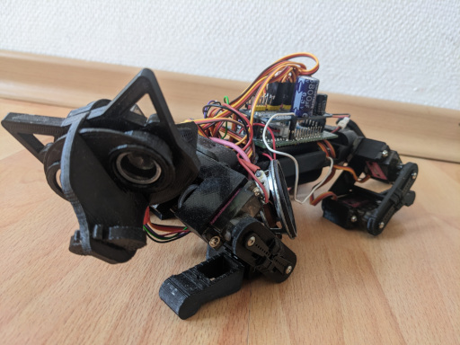
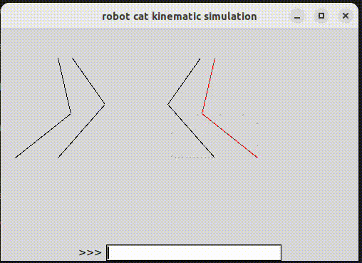

# opencat_micropython
micropython implementation for esp32 of the opencat

I used Ez 3D Printed OpenCat from thingiverse: https://www.thingiverse.com/thing:3384371

Here you see the first steps it made: https://www.youtube.com/watch?v=MNgKbt5TRXs

This project is in a very early state. There are some issues with the power of the motor. In theory, the motions work quite nicely, and there is high flexibility due to the parameterization (see simulator). I did not look at the original opencat firmware, so pinout is probably different.
Servo ids: FLS, FLK, BLS, BLK, FRS, FRK, BRS, BRK, T, HY, HP
- F: front leg
- B: back (hind) leg
- T: tail
- H: head
- L: left
- R: right
- S: shoulder
- K: knee
- Y: yaw (left-right, shake)
- P: pitch (up-down, nod)

## Features: 
- Two Link kinematics
  - used for the legs to control the servo angles
- linear motion plans for all legs, tail and head:
  - A motion plan is a function in time that returns the servo angles theta
  - f(time)=Theta1,Theta2
  - defined by a set of 2D points and the time the movement between the points should take
- parameterized leg positioning >> stand():
  - height: avg leg height above ground in cm [default=7]
  - tilt: height difference between front and hind legs [default=0]
  - roll: height difference between left and right legs [default=0]
  - ground_pos: mean ground position of the legs relative to the vertical projection of the shoulders [default=0]
  - spread: difference in ground position between front and hind legs [default=0]
  - t: time in seconds until this position is reached [default=1]
- two different gaits: walk() and tripod_gait()
  - all parameters of stand() and additionally:
  - n_steps: number of steps (with all 4 legs) [default=10]
  - lift: hight in cm of leg above ground [default=1]
  - step_size: in cm [default=8]
  - direction: difference of step size between left and right to walk left/right [default: 0]
  - speed: speed in cm/second [default=6]
- some simple gestures (sleep, eat, nod, shake haead, wag)

## Simulator:

- graphical simulator that runs the same code as the robot
- text filed to run repl like commadns (e.g. "cat.walk()")

## My Plans:
### Software (ESP32 micropython)
- telnet based remote control (also include in simulator?)
- walk backwards (bug prevents negative speed or step_size)
- 
- more dyamic gaits
- motion plan with circular trajectories ( better walking?)
- integrate head and tail to stabilize waling 
- integrate sensors -> requires hardware
- autonomous mode (obstical avoidance) -> requires sensors
- more cute gestures
- sound (meow?...) with according head movement
- orientation aware motion plans (requires sensors)
- object recognition (on camera module)
- deepsleep standby?

### Hardware
- Currently:
  - TTGO MINI 32 V2.0 board (ESP32 with battery management)
  - 11 TowerPro SG90M servos (seem to work at 4 V)
  - PCA9685 i2c Servo controller
  - power: 
    - 1S 3.7 lipo (full at 4.2V)
    - servos are powerd directly, hence battery capacity cannot be completely used.
- Plans:
  - add a switch
  - nice body
  - Test 7.2V 2S battery with potent 5V buck converter to power servos and esp
      - if sufficient: esp board (which has a 3.3V converter) 
      - audio amp
      - ultrasonic sensor
  - MPU gyrosensor (i2c)
  - ultrasonic senosor (need to get a 3.3V version)
  - 5V audio amp (at ESP DAC)
    - try old headphone speakers?
  - Servo feedback? (currently analog feedback on one of the sensors prepared to monitor motion)
  - camera module (e.g. JeVois, openMV)
  - robot arm head, like the bosten dynamics spot mini
